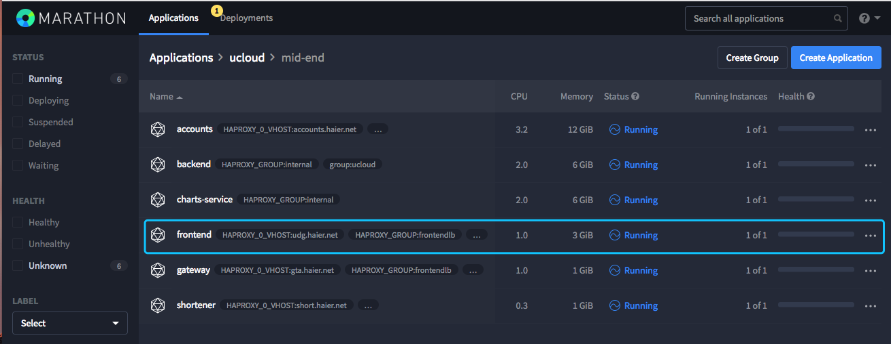
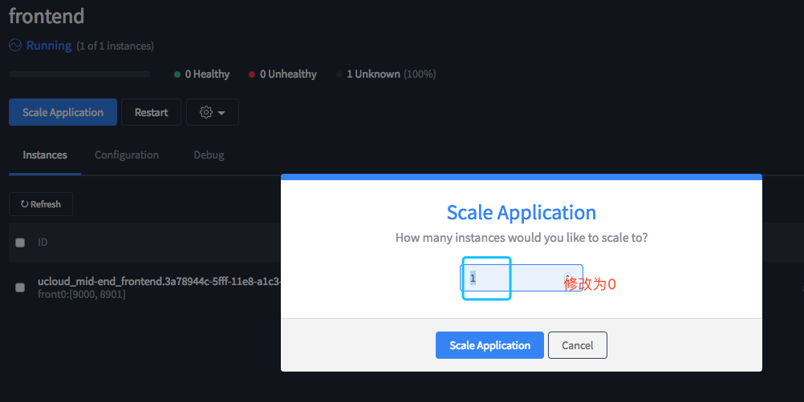

# frontend服务

## 介绍

服务：frontend

描述：主要是前端页面的展示。

## 操作 {#-0}

状态

打开marathon界面frontend在ucloud/mid-end下



status显示running就是运行状态

命令查看：

```text
docker ps ## 可以查看当前运行的容器

docker logs --tail 100 -f front_id ## 查看frontend的运行日志
```

## frontend的启动与关闭 {#frontend-0}

启动：

切换到/apps/svr/growing-frontend下执行`install.sh`即可

```text
cd /apps/svr/growing-frontend ; sh install.sh
```

停止：  
在marathon界面直接scale application 设置为0即可



## frontend的基本操作 {#frontend-1}

在执行启动install.sh服务的时候它会调用当前目录下的package.json这个文件是frontend的所有配置信息，也就是说是frontend的配置文件，执行成功后会在marathon界面看到frontend的状态信息，前提是marathon界面没有该服务，如果该服务已经正常运行，并不会影响当前运行的服务

修改配置：


点击配置—点击编辑会进入设置参数的界面


同时也支持json模式显示


